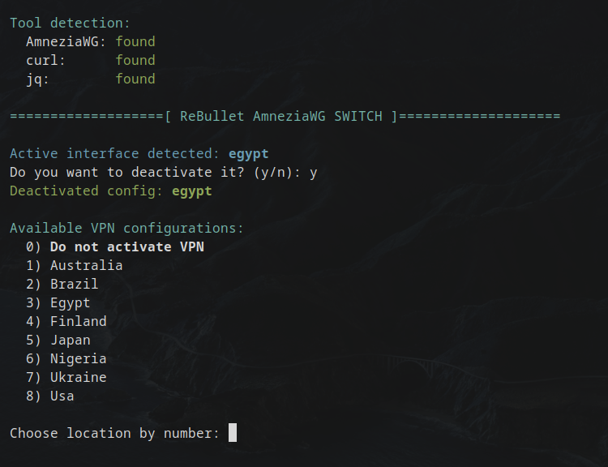

# ReBullet WireGuard Switch

A fast, terminal-based VPN configuration switcher built for WireGuard and AmneziaWG users. Designed with clarity, speed, and automation in mind.



---

## 🚀 Features

- **Auto-detects** installed backend: AmneziaWG or classic WireGuard
- **Interactive interface** for selecting configs from:
  - `/etc/amnezia/amneziawg` (AmneziaWG)
  - `/etc/wireguard/` (WireGuard)
- **Deactivates** active interfaces before switching
- **Public IP check** via `curl` (IPv4 & IPv6)
- **Country detection** for VPN IPs via:
  - Cloudflare
  - Netflix
  - Steam Store
- **Ping Test** (5x per host) to:
  - `1.1.1.1` (Cloudflare)
  - `8.8.8.8` (Google)
  - `77.88.8.8` (Yandex)
- **Clean and color-coded terminal output**
- **Minimal dependencies**: `bash`, `curl`, `jq`, `ping`

---

## 📂 Folder Requirements

All WireGuard or AmneziaWG configuration files must be placed in:

```
# For AmneziaWG:
/etc/amnezia/amneziawg/

# For classic WireGuard:
/etc/wireguard/
```

Supported format:
```
/etc/amnezia/amneziawg/
├── finland.conf
├── usa.conf

/etc/wireguard/
├── germany.conf
├── france.conf
```

---

## 🧪 Output Example

```
Tool detection:
  AmneziaWG: found
  curl:      found
  jq:        found

=================== [ ReBullet AmneziaWG SWITCH ] ===================

Available VPN configurations:
  1) Finland
  2) Japan
  3) USA

Choose location by number: 2

Activating config: japan

IP Address Check:
  IPv4: 193.XXX.XXX.20
  IPv6: Not available

Service Country Check (IPv4 / IPv6):
  Cloudflare : JP    n/a
  Netflix    : JP    n/a
  Steam      : JP    n/a

Ping Test (5 times per host)
  Ping         Cloudflare Google     Yandex    
  ------------------------------------------
  Attempt 1    8.44 ms    14.3 ms    41.9 ms
  Attempt 2    8.41 ms    13.9 ms    42.2 ms
  ...
```

---

## 🛠 Dependencies

The following tools are required:

- curl
- jq
- Either:
  - amneziawg-tools + amneziawg-go
  **or**
  - wireguard-tools + wireguard-go

---

## 📦 Installation

```bash
git clone https://github.com/rebullet/rebullet-wg-switch.git
cd rebullet-wg-switch
chmod +x ReBulletWG.sh
sudo ./ReBulletWG.sh
```

---

## 📄 License

This project is licensed under the MIT License. See [LICENSE](./LICENSE) for details.

---

## 🤝 Author

Made with ❤️ by **ReBullet**

Feel free to fork, contribute, or use this script in your own VPN workflow.

